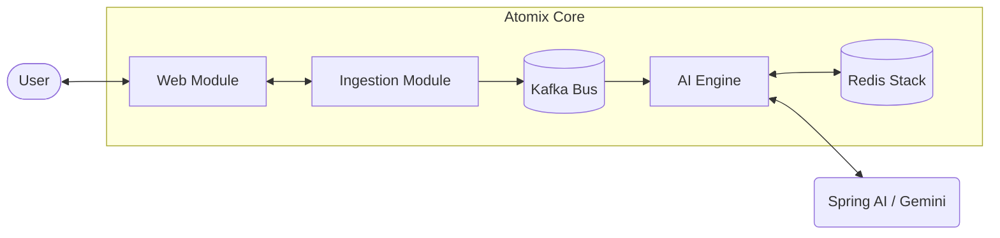

# System Architecture: Modular Monolith

## High-Level Topology
Atomix is built as a modular monolith. This ensures a clean development experience while providing a clear path to microservices if scaling requirements demand it.

## Module Definitions

### Web Module (`:app`)
The primary entry point. It hosts the REST controllers, WebSocket handlers, and serves the React frontend. It is intentionally thin, delegating all logic to sub-modules.

### Ingestion Module (`:modules:ingestion`)
Responsible for content extraction and sanitization. 
*   **File Providers:** Handlers for PDF, Markdown, and plain text.
*   **Normalizer:** Ensures all text entering the system follows a consistent encoding and structure.

### AI Engine (`:modules:engine`)
The core orchestrator using LangGraph4J.
*   **Workflows:** Defines the graph nodes and state transitions.
*   **Spring AI Client:** Manages interactions with LLMs and Embedding models.
*   **Linker:** Implements the semantic relationship logic.

### Knowledge Module (`:modules:knowledge`)
The data access layer.
*   **Repositories:** Reactive interfaces for Redis.
*   **Search Service:** Wraps Redis Vector Search for RAG (Retrieval-Augmented Generation) capabilities.

## Communication Patterns
*   **Internal:** Modules communicate via the `common` project's event models.
*   **External:** The system relies on Kafka for durability and Redis for low-latency state access.
